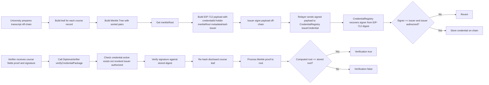

# ECC + Merkle Logic Flow (Digital Diploma)

## 1. Muc tieu phan nay

He thong dung 2 lop bang chung:

- `ECC (ECDSA + EIP-712)`: xac nhan truong dai hoc da ky payload credential.
- `Merkle Tree`: xac nhan mon hoc/diem duoc disclose thuc su nam trong transcript da commit.

Contract khong luu toan bo transcript. Tren chain chi luu:

- `credentialId`
- `issuer`
- `holder`
- `merkleRoot`
- `metadataHash`
- `revoked`

## 2. Luong tong quan



## 3. Cong thuc logic can nho

### 3.1 Credential digest (EIP-712)

Credential payload duoc hash theo typed data:

- Type: `DiplomaCredential(bytes32 credentialId,address holder,bytes32 merkleRoot,bytes32 metadataHash,address issuer)`
- Domain:
  - `name = "CredentialRegistry"`
  - `version = "1"`
  - `chainId` hien tai
  - `verifyingContract = CredentialRegistry address`

Digest nay duoc:

1. Ky off-chain boi issuer.
2. Verify trong `CredentialRegistry.issueCredential(...)`.
3. Dung lai de check chu ky trong `DiplomaVerifier.verifyCredentialSignature(...)`.

### 3.2 Transcript leaf hash

Moi leaf la full course record:

- `courseId`
- `courseName`
- `semester`
- `creditsScaled` (`uint32`, khong dung float)
- `grade`

Leaf hash:

- `leaf = keccak256(abi.encode(TYPEHASH, keccak256(courseId), keccak256(courseName), keccak256(semester), creditsScaled, keccak256(grade)))`

Node pair hash:

- `parent = keccak256(sort(a, b))`

## 4. Core files can tap trung doc

- [contracts/CredentialRegistry.sol](/Users/charlie/Desktop/Code/2025.2-Blockchain/contracts/CredentialRegistry.sol)
  - Verify signature EIP-712 khi issue credential.
  - Luu credential state va revoke state.
  - Expose `getCredentialDigest(...)`.

- [contracts/DiplomaVerifier.sol](/Users/charlie/Desktop/Code/2025.2-Blockchain/contracts/DiplomaVerifier.sol)
  - `verifyCredentialStatus(...)`: active credential check.
  - `verifyCredentialSignature(...)`: verify ECC signature.
  - `verifyCredentialPackage(...)`: verify end-to-end (`status + signature + merkle proof`).
  - `hashTranscriptLeaf(...)`: on-chain leaf hash helper.

- [contracts/libraries/DiplomaCrypto.sol](/Users/charlie/Desktop/Code/2025.2-Blockchain/contracts/libraries/DiplomaCrypto.sol)
  - Shared hash logic (credential struct hash, transcript leaf hash, Merkle proof processing).

- [scripts/utils/diploma.js](/Users/charlie/Desktop/Code/2025.2-Blockchain/scripts/utils/diploma.js)
  - Off-chain helper de build Merkle tree, hash leaf, sign payload, compute digest.
  - Day la file can dung lai cho backend.

- [scripts/demoFlow.js](/Users/charlie/Desktop/Code/2025.2-Blockchain/scripts/demoFlow.js)
  - Demo signed issuance + status verification + revocation.

- [scripts/demoMerkleProof.js](/Users/charlie/Desktop/Code/2025.2-Blockchain/scripts/demoMerkleProof.js)
  - Demo day du ECC + Merkle package verification.

- [test/CredentialRegistry.test.js](/Users/charlie/Desktop/Code/2025.2-Blockchain/test/CredentialRegistry.test.js)
  - Case issue signed credential, wrong signer, wrong signature, duplicate, revoke.

- [test/DiplomaVerifier.test.js](/Users/charlie/Desktop/Code/2025.2-Blockchain/test/DiplomaVerifier.test.js)
  - Case signature verification, package verification, tampered leaf/proof, revoke, issuer removed.

## 5. Onboard nguoi moi vao repo

### 5.1 Doc theo thu tu de hieu nhanh

1. [scripts/demoFlow.js](/Users/charlie/Desktop/Code/2025.2-Blockchain/scripts/demoFlow.js) (nhin business flow tong quan)
2. [scripts/demoMerkleProof.js](/Users/charlie/Desktop/Code/2025.2-Blockchain/scripts/demoMerkleProof.js) (nhin ECC + Merkle ket hop)
3. [contracts/CredentialRegistry.sol](/Users/charlie/Desktop/Code/2025.2-Blockchain/contracts/CredentialRegistry.sol)
4. [contracts/DiplomaVerifier.sol](/Users/charlie/Desktop/Code/2025.2-Blockchain/contracts/DiplomaVerifier.sol)
5. [contracts/libraries/DiplomaCrypto.sol](/Users/charlie/Desktop/Code/2025.2-Blockchain/contracts/libraries/DiplomaCrypto.sol)
6. Test files de xem expected behavior.

### 5.2 Chay local tu dau

```bash
npm install
npx hardhat compile
npx hardhat test
```

Terminal 1:

```bash
npx hardhat node
```

Terminal 2:

```bash
npx hardhat run scripts/deployAll.js --network localhost
npx hardhat run scripts/demoFlow.js --network localhost
npx hardhat run scripts/demoMerkleProof.js --network localhost
```

### 5.3 Mental model ngan gon

- `IssuerRegistry`: ai duoc phep cap bang.
- `CredentialRegistry`: luu bang da cap + revoke, va xac thuc signature khi cap.
- `DiplomaVerifier`: endpoint verify cho ben thu 3.
- `DiplomaCrypto`: 1 nguon su that cho hash formula.
- `scripts/utils/diploma.js`: off-chain side phai biet hash/sign giong 100% on-chain.

## 6. Luu y cho backend/frontend

- Khong tu viet lai formula hash/sign theo nho nho. Tai su dung helper trong `scripts/utils/diploma.js` hoac copy dung 1:1.
- `credits` phai duoc normalize sang `creditsScaled` integer truoc khi hash.
- Neu mismatch bat ky field nao (`courseName`, `semester`, `grade`, ...) thi proof se fail dung ky vong.
- Signature chi dung cho dung `chainId + verifyingContract` (co replay protection theo domain EIP-712).
